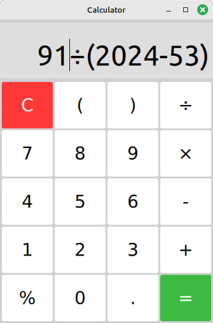
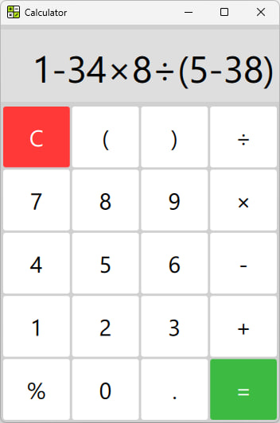

# Calculator_Qt

[](https://github.com/Dariarty/Calculator_Qt/blob/main/README.md)
[](https://github.com/Dariarty/Calculator_Qt/blob/main/README.ru.md)

Simple desktop GUI Calculator with Flat design using Qt/QML and C++.

## About The Project

This application provides convenient and simple way to calculate arithmetic operations. </br>
App features basic mathematic calculations and supports input from keyboard.  </br>
</br>
The input expression is evaluated as a JavaScript code using QJSEngine. </br>

## Screenshots

| Built on Linux Mint 21.3 using Qt 5.15 | Built on Windows 11 using Qt 6.7.2 |
| --- | --- |
 | 

## Building From Source Code
Building both for Windows and Linux is supported. </br>
Minimal supported Qt version is Qt 5.10. Maximum tested Qt version for building the app is Qt 6.7.2 </br>
1.  Download and install Qt5.10+/Qt6, Qt Creator and MinGW compiler.</br>
2.  Configure Qt Creator Kit for Desktop. </br>
3.  Clone the repo.
     ```sh
     git clone https://github.com/Dariarty/Calculator_Qt.git
     ```
4.  Open src/calculator.pro in Qt Creator.</br>
5.  Run qmake.</br>
5.  Build the project in Qt Creator.</br>

## ToDo

- [x] Design a GUI
- [x] Add Basic Functionality to calculate math expressions
- [x] Switch to QJSEngine instead of Function() constructor
- [x] Publish first release
- [ ] Add tab with calculations history
- [ ] Add additional buttons for extended functionality
- [ ] Improve Display's visibility by switching to multiline layout and allowing vertical scrolling
- [ ] Develop C++ Math Expression Parser


See the [open issues](https://github.com/Dariarty/Calculator_Qt/issues) for a full list of planned features and known issues.

## Attributions

Application Icon is designed by [Freepik](https://freepik.com)

## License

Distributed under the MIT License. See [LICENSE](LICENSE) for more information.
