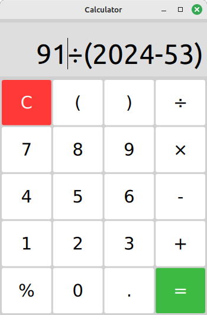
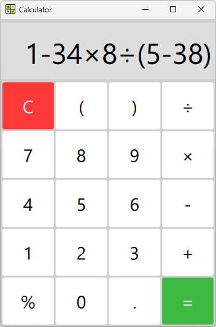

# Calculator_Qt

[](https://github.com/Dariarty/Calculator_Qt/blob/main/README.md)
[](https://github.com/Dariarty/Calculator_Qt/blob/main/README.ru.md)

Простой десктопный GUI Калькулятор в стиле Flat Design с использованием Qt/QML и C++

## О проекте

Приложение предлагает простой и удобный способ делать повседневные вычисления. </br>
Реализованы базовые математические операции, есть поддержка ввода при помощи кнопок и клавиатуры. </br>
</br>
Строка с математическим выражением выполняется как код JavaScript с использованием QJSEngine. </br>

## Скриншоты

| Сборка на Linux Mint 21.3 с Qt 5.15 | Сборка на Windows 11 с Qt 6.7.2 |
| --- | --- |
 | 

## Сборка исходного кода
Поддерживается сборка на Windows и Linux.</br>
Минимальная поддерживаемая версия Qt 5.10. Также приложение может быть собрано на Qt6, протестирована сборка на Qt 6.7.2 </br>

1.  Загрузить Qt5.10+/Qt6, Qt Creator и компилятор MinGW.</br>
3.  Сконфигурировать Desktop Kit в Qt Creator. </br>
4.  Склонировать репозиторий
     ```sh
     git clone https://github.com/Dariarty/Calculator_Qt.git
     ```
5.  Открыть файл проекта src/calculator.pro в Qt Creator</br>
5.  Запустить qmake.</br>
5.  Собрать проект в Qt Creator.</br>

## Планы на разработку

- [x] Разработать макет пользовательского интерфейса
- [x] Реализовать приложение с базовым функционалом арифметических операций
- [x] Использовать QJSEngine вместо конструктора Function()
- [x] Опубликовать первый release
- [ ] Добавить вкладку с историей вычислений
- [ ] Добавить новые кнопки с другими математическими функциями
- [ ] Улучшить дисплей, сделав его многострочным и прокручиваемым
- [ ] Разработать собственный парсер математических выражений на C++


Смотри [open issues](https://github.com/Dariarty/Calculator_Qt/issues) для полного списка запланированных улучшений и известных проблем.

## Атрибуция

Иконка приложения создана [Freepik](https://freepik.com)

## Лицензия

Распространяется под MIT License. Смотри [LICENSE](LICENSE) для полной информации.
